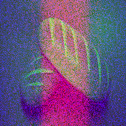
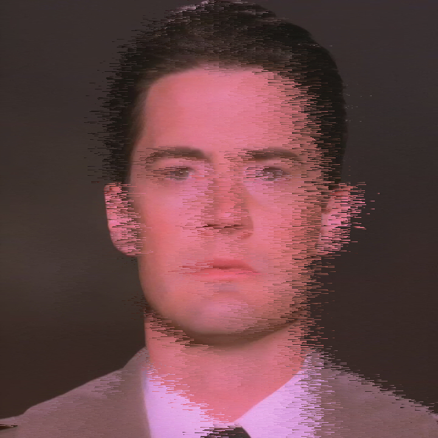
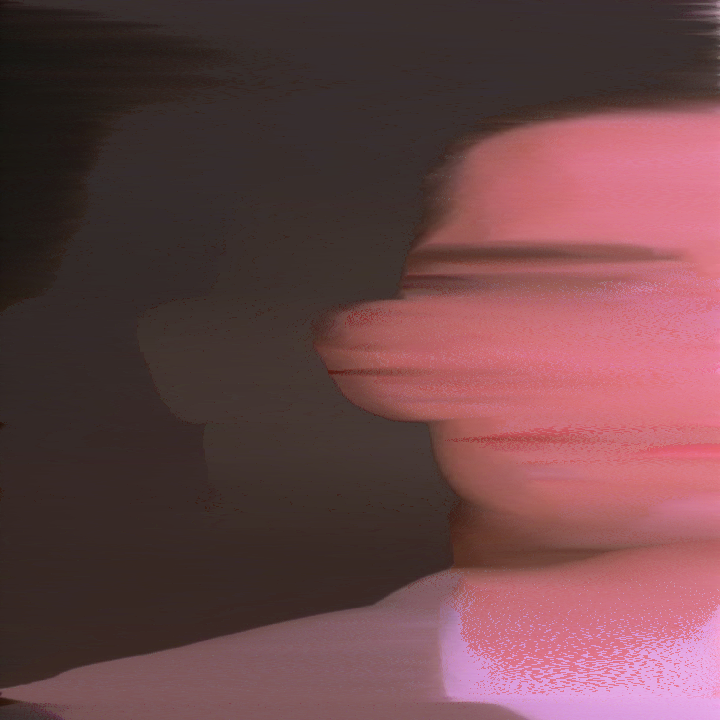
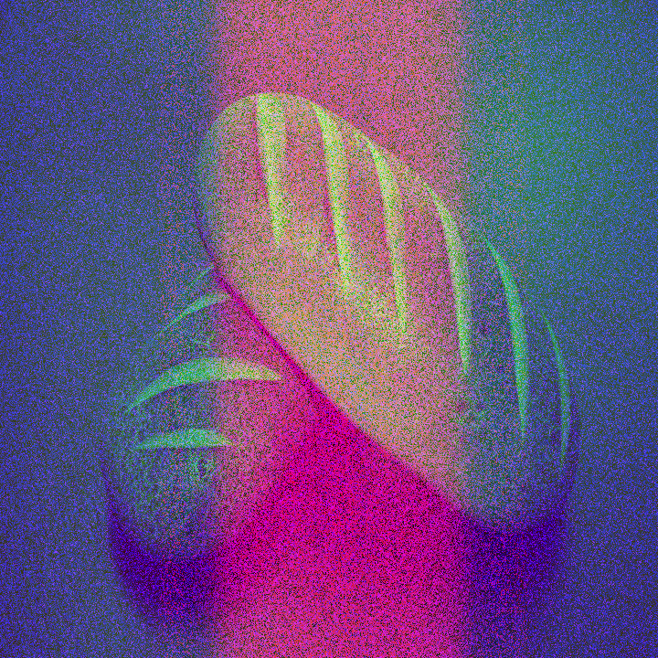

# ImageShuffle
ImageShuffle is a weird program that lets you sort the pixels in an image, alongside giving you the tools to generate images that can contain two or more images depending on the layering.

## What can I do with it?
Here's a few examples of some of the stuff that ImageShuffle can do:

- Generate unique art

`python sort.py cooper.jpg 50 horz sat randsample`

- Sort your favorite images into weird looking blobs, based on color!

`python sort.py cooper.jpg 720 horz r sample`

- Create hidden images in other images by randomizing their color channels, then sorting by a certain color channel! (it's easier than it sounds!)

`python randomize.py cooper.jpg bread.jpg b`

`python sort.py randomized.png 2 vert b frame`

- Create animations of all of the above (using the frame command!)

`python randomize.py cooper.jpg bread.jpg b`

`python sort.py randomized.png 100 vert b frame`

## Okay, you convinced me: How do I use it?
Tested on `Python 3.13.0` with `pillow (11.1.0)` so if something changes in the future, that's the package versions used here!

`pip install pillow`

`python sort.py`

thats literally it

## More Examples please!
`python sort.py` and `python randomize.py` should have more examples and explanations on using the tool to make more stuff! You can also see the examples folder, although there is only a few images in there.

## Contribution
why would you want to contribute to this

